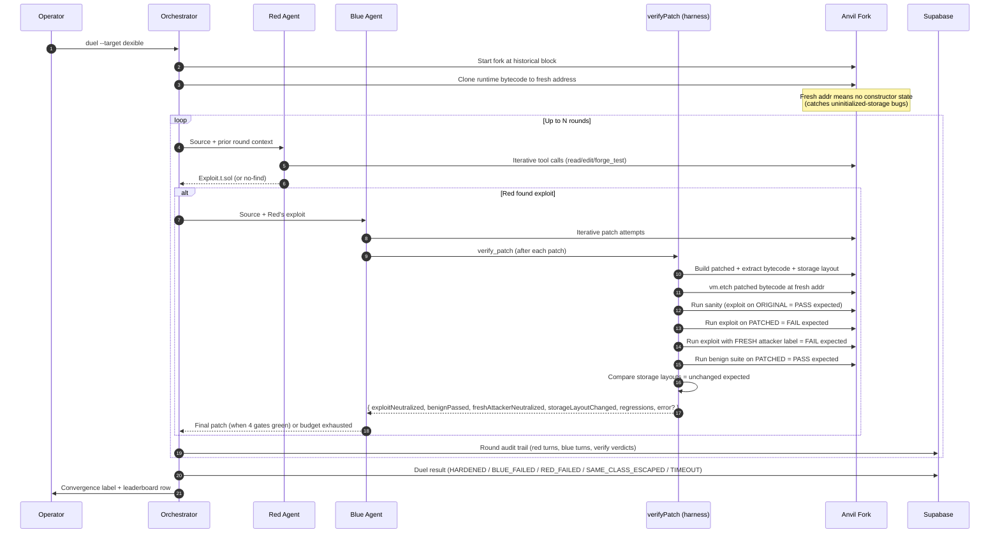
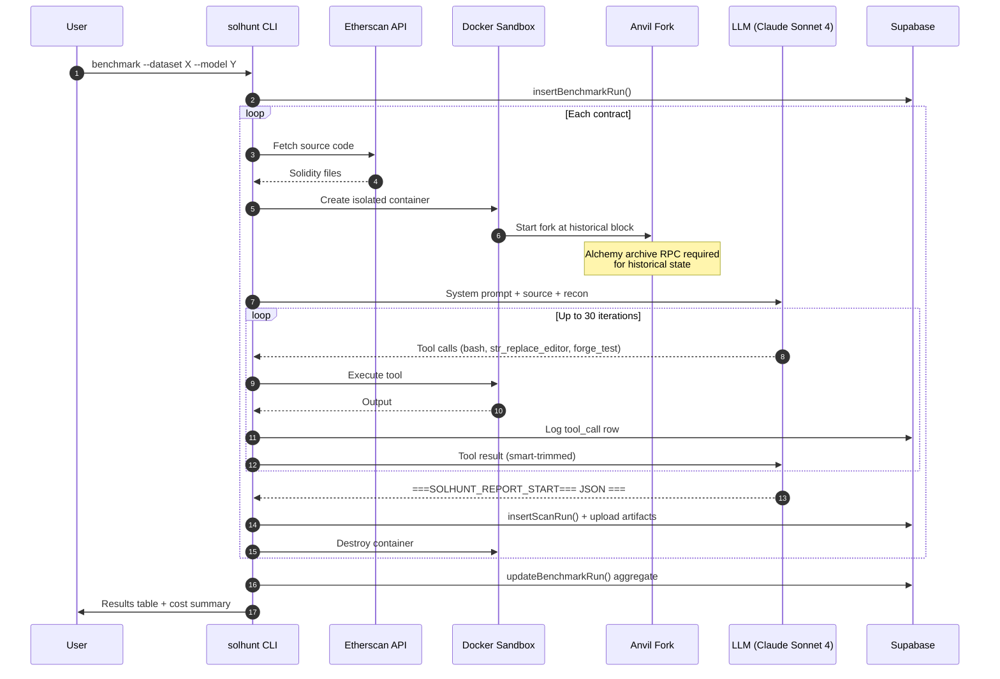
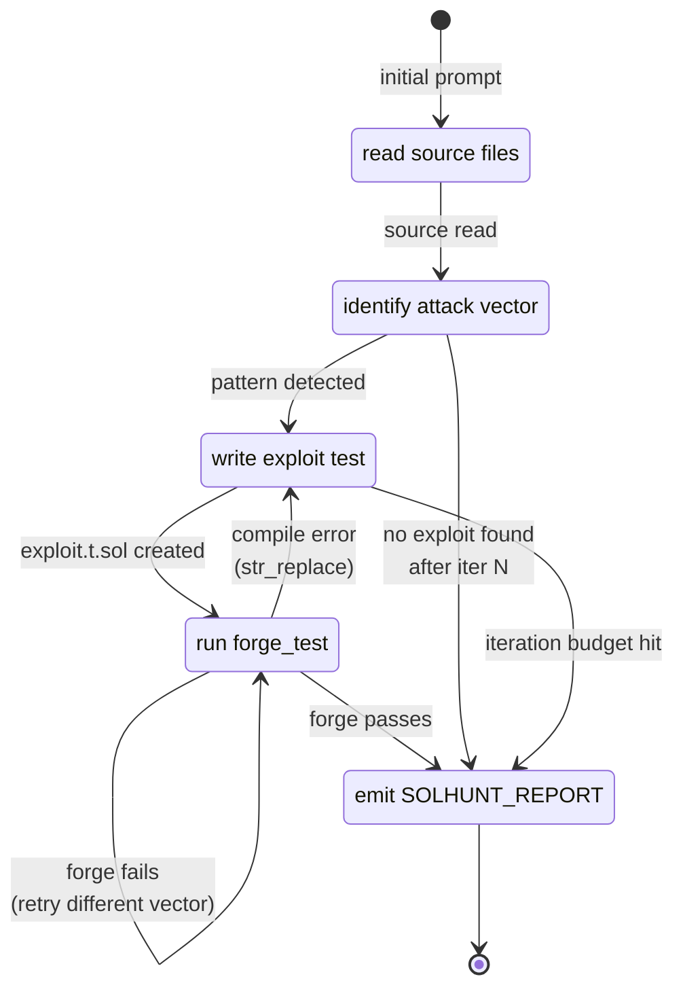
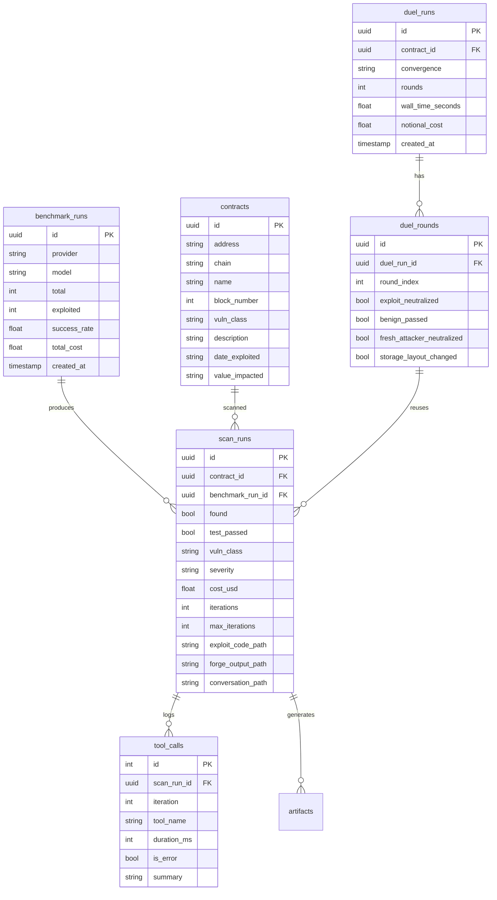
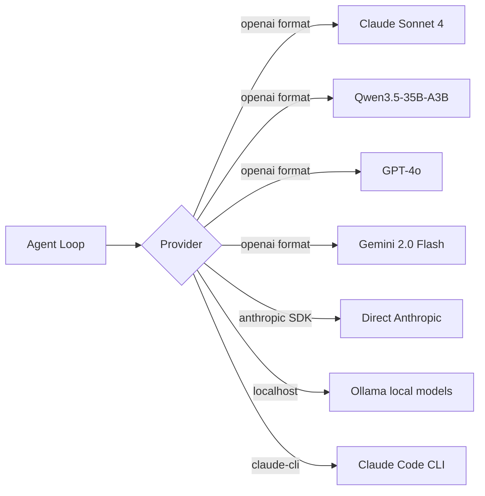

# Architecture

> **TL;DR (60-second read):** This repo holds two related but separate projects.
> **Solhunt** is a single-agent scanner: give it a contract, it writes a Foundry exploit if one exists, otherwise it emits a structured no-find report. Numbers: 67.7% on a curated 32-contract DeFiHackLabs subset, 13.7% on a 95-contract random draw — both published honestly. **Solhunt-Duel** sits on top: Red writes the exploit, Blue writes a Solidity patch, a server-side harness enforces four gates the LLMs cannot see or modify (`exploitNeutralized`, `benignPassed`, `freshAttackerNeutralized`, `storageLayoutPreserved`) before declaring convergence. The premise: agents will lie about success if you let them, so the verdict lives outside the agent.
>
> **Live artifacts:** [leaderboard](https://solhunt-duel.netlify.app/leaderboard/) · [gate verifier walkthrough (PROOF.md)](PROOF.md) · [v2 corpus expansion plan](PLAN-V2-BENCHMARK-EXPANSION.md)

---

## The two projects

| | Solhunt (predecessor) | Solhunt-Duel (current) |
|---|---|---|
| **Mode** | Single-agent: Red writes exploits | Adversarial: Red writes exploits, Blue writes patches |
| **Verdict source** | Foundry forge_test exit code | Foundry forge_test against four server-side gates |
| **Convergence claim** | "Found exploit" iff forge passes | "Hardened" iff Red exploits AND Blue patches AND all 4 gates green |
| **Output** | Per-contract exploit-or-no-find report | Per-duel round-by-round trace + final convergence label |
| **Headline numbers** | 67.7% curated / 13.7% random (32 / 95 contracts) | 1 hardened / 3 red-failed / 3 blue-failed / 1 same-class-escaped / 2 timeout (10 contracts in Phase 4) |

The two share docker sandbox + anvil fork + supabase persistence. They differ in agent loop and verifier.

---

## Solhunt-Duel — adversarial loop with server-side gates

The four gates and what they catch:

| Gate | Computed in `verifyPatch()` | Defeats |
|---|---|---|
| `exploitNeutralized` | exploit FAILS on patched bytecode | "patch did nothing" |
| `freshAttackerNeutralized` | exploit FAILS from a different EOA | "patch only blocks the original attacker address" |
| `benignPassed` | benign happy-path tests still PASS | "patch deleted the function entirely" |
| `storageLayoutChanged == false` | original vs patched storage layout slots/offsets/types match | "patch silently bricks existing state" |

Source: [`src/sandbox/patch-harness.ts`](https://github.com/claygeo/solhunt-duel/blob/master/src/sandbox/patch-harness.ts) · Full walkthrough: [PROOF.md](PROOF.md)

**Convergence taxonomy** (what each leaderboard label means):

- `HARDENED` — Red found an exploit, Blue produced a patch, all 4 gates green
- `BLUE_FAILED` — Red found exploit, Blue exhausted budget without all 4 gates green
- `RED_FAILED` — Red emitted no-find within budget; contract may be safe OR our agent missed
- `SAME_CLASS_ESCAPED` — Blue's patch passed gates, Red pivoted to a DIFFERENT vulnerability of the same class — escape, not hardening
- `TIMEOUT` — wall-clock cap hit before any agent emitted a final verdict

The taxonomy is deliberately five-way, not two-way. "Did Blue patch successfully" and "is the contract now safe" are different questions; the labels keep them separate.

---

## Solhunt (single-agent scanner) — predecessor

The original loop. Used to produce the headline 67.7% / 13.7% numbers.

### Agent loop state machine

---

## Shared infrastructure

### Data model

### Why Docker sandbox per scan
- Isolation: agent can't escape or affect host
- Reproducibility: every scan starts from identical state
- Preloaded DeFi libs (Aave V3, Compound, Uniswap V2/V3, OZ v4+v5, Chainlink)
- Destroyed after scan, no lingering state

### Why Alchemy (archive node)
- Historical block forking requires archive state
- Free public RPCs (llamarpc, publicnode) don't serve archive state
- Alchemy free tier: 300M compute units/month, sufficient for benchmarks
- We hit this as a hard blocker before switching

### Why Supabase for persistence
- Separates transactional data (pg) from artifacts (storage bucket)
- Service role key = no auth surface for our internal pipeline
- Artifacts stored as `runs/<scan_id>/{exploit.sol, conversation.json.gz, forge_output.txt}`
- Queryable from analysis scripts without re-fetching

### Why fire-and-forget flush pattern
- `DataCollector` buffers tool calls, messages, artifacts in memory during scan
- One `flush(scanRunId)` call after scan completes
- All Supabase writes wrapped in try/catch that never throws
- Scan result is never blocked by storage failures
- If Supabase is down, we still get the scan result, we just lose persistence for that run

### Why auto-checksum addresses
- LLMs emit lowercase hex addresses frequently
- Forge rejects with EIP-55 checksum errors
- Agent wastes 5-10 iterations fighting this
- Fix: regex replace all `0x[40 hex]` with keccak256-computed checksums on every .sol file write

### Why vm.prank false-positive guard
- `vm.prank(admin)` makes next call appear from admin
- Agent discovered it could "exploit" access-controlled functions this way
- But pranking as owner to call owner functions proves nothing
- System prompt now lists valid uses (whale, EOA, governance-after-vote) and flags invalid use

### Why fresh-address bytecode cloning (Solhunt-Duel only)
- Original contract address has constructor state, immutables, possibly initializer storage
- vm.etch swaps runtime bytecode but does NOT replay the constructor
- If we just etched on the original address, Blue's patches that depend on initializer storage would silently fail
- Fix: clone bytecode to a fresh deterministic address with anvil_setCode, then run all verify stages against that address. Each stage anvil_setCode's the correct variant (original / patched) before running.

---

## Cost controls

Two layers of protection:

1. **Failure circuit breaker** (existing, pre-Duel):
   - If last 3 contracts all failed without producing a report → stop
   - If last 3 contracts all hit the same error → stop

2. **Budget circuit breaker**:
   - `--max-budget <usd>` global cap
   - Checks cumulative cost between batches
   - Stops immediately if cap exceeded
   - Warns at 75% usage

Without these, a stuck agent in a 30-iteration loop at $3+ per contract could burn through an $80 budget in the first ~27 contracts.

---

## Model abstraction

One provider abstraction, multiple backends. Qwen-specific handling: append `/no_think` to disable reasoning on local models. Cost calculated per-token against PRICING table. Solhunt-Duel adds a Claude Code CLI backend (uses Max subscription, not API metered) for autonomous overnight runs.

---

## Where to read the code

For the gate verifier (the load-bearing claim of Solhunt-Duel): start at [`src/sandbox/patch-harness.ts:89`](https://github.com/claygeo/solhunt-duel/blob/master/src/sandbox/patch-harness.ts#L89) — the `verifyPatch()` function is the entire gate-checking pipeline in 130 lines.

For the duel orchestration: [`src/duel/orchestrator.ts`](https://github.com/claygeo/solhunt-duel/blob/master/src/duel/orchestrator.ts) — Red/Blue round coordination, fresh-address bytecode cloning, audit trail.

For the single-agent scanner: [`src/agent/`](https://github.com/claygeo/solhunt-duel/tree/master/src/agent) — read loop, prompts, tool definitions.

For the benchmark runner: [`src/bench/`](https://github.com/claygeo/solhunt-duel/tree/master/src/bench) — phase0 (single-agent) and phase1 (duel) runner entry points.

---

## Honest limitations

- The Phase 4 duel set is 10 contracts. That's small-N. The v2 expansion plan in [PLAN-V2-BENCHMARK-EXPANSION.md](PLAN-V2-BENCHMARK-EXPANSION.md) is how we get to 50+ with vuln-class diversity and adversarial-clean baseline.
- The 67.7% / 13.7% gap is real and unresolved. Sandbox limitations dominate the failure modes on random samples (compiler version mismatches, cross-contract dependencies the harness doesn't pre-load). See [README §The numbers](https://github.com/claygeo/solhunt-duel/blob/master/README.md#the-numbers--be-precise) for the failure breakdown.
- The gates falsify positive claims, not negative ones. A `HARDENED` verdict means "we ran the four checks and they all passed." It does NOT mean "the contract is now bulletproof." Different claim, different scope.
- MEV and front-running are invisible to the verifier. Deterministic block timing on a frozen fork. Real-world transaction ordering is not modeled.
- Multi-contract attack chains that need specific pool / oracle state at specific blocks fail on our harness fork even when the exploit works on mainnet. We don't pre-load arbitrary DeFi state. Those collapse to RED_FAILED, not falsely-hardened runs.

If you find a counter-example to any of these, please file an issue. Honest negative results compound; spin destroys.
